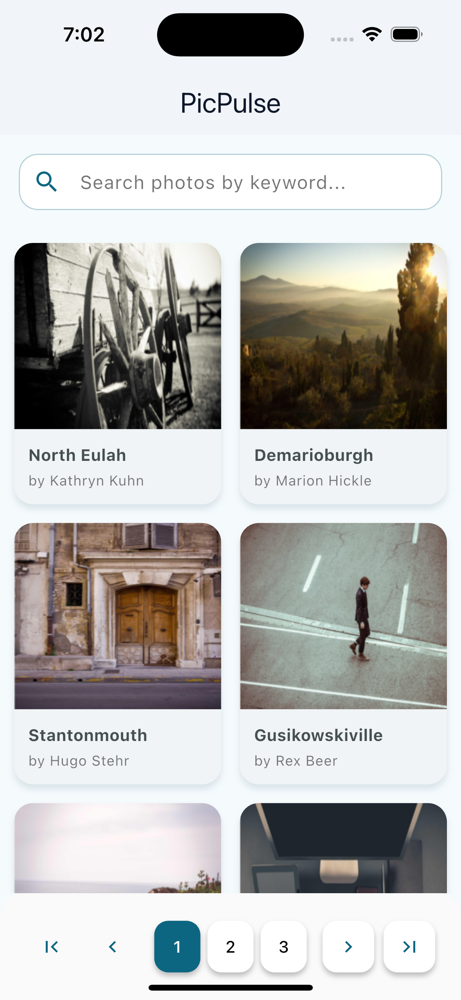
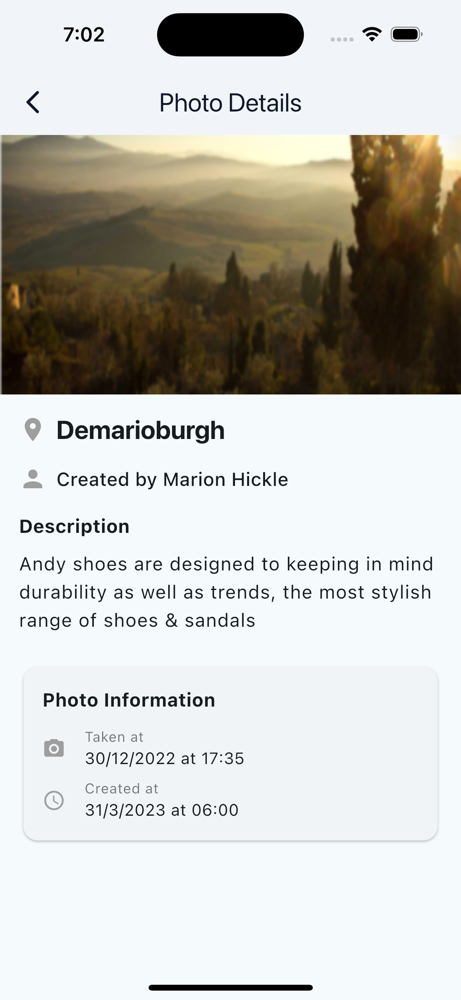

# PicPulse 📸

A Flutter app that displays and searches stock photos with offline caching capabilities.

## Screenshots

### Photo List Screen



### Photo Detail Screen



## Features

- **Photo Gallery**: Browse photos in chronological order with location info
- **Smart Search**: Real-time keyword search across descriptions, locations, and creators
- **Photo Details**: View individual photos with full metadata
- **Offline Caching**: Browse cached photos without internet connection
- **Pagination**: Navigate through large photo collections

## Tech Stack

- **Framework**: Flutter 3 with Dart 3
- **State Management**: Bloc (flutter_bloc)
- **HTTP Client**: Dio
- **Local Storage**: Hive
- **Image Caching**: cached_network_image
- **Testing**: flutter_test + mockito + bloc_test

## Getting Started

1. Clone the repository
2. Run `flutter pub get`
3. Run `flutter run`

## Testing

```bash
# Run unit/widget tests
flutter test
# Run integration tests
flutter test integration_test/
```
